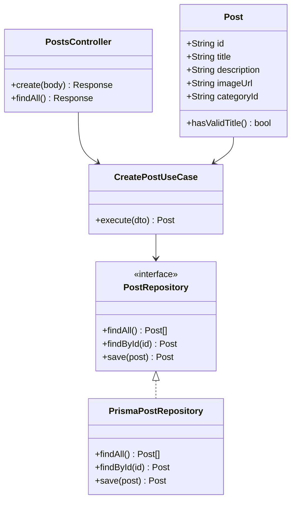

# Asignación de Tareas — Clean Architecture Refactor

## Ramas de trabajo

| Persona | Rama | Contenido |
|---------|------|-----------|
| 1 (Domain) | `main` (ya completo) | Entidades, interfaces de repositorio, servicios de dominio |
| 2 (Application) | `feature/application` | Use cases y DTOs de aplicación |
| 3 (Persistence) | `feature/persistence` | Repositorios Prisma |
| 4 (HTTP + Docs) | `feature/http` | Controladores, módulos, wiring, `.docs/README.md` |

Cada integrante debe:
```bash
git clone https://github.com/Zywite/INFO1156-AC_06-Clean-Architecture.git
cd INFO1156-AC_06-Clean-Architecture
git checkout feature/su-rama
```

Al terminar, crear un Pull Request dentro del fork (de `feature/*` a `main`).

---

## Estructura objetivo

```
src/
├── domain/                          # Persona 1
│   ├── entities/
│   │   ├── post.entity.ts
│   │   ├── comment.entity.ts
│   │   ├── like.entity.ts
│   │   ├── category.entity.ts
│   │   └── prohibited-word.entity.ts
│   ├── repositories/
│   │   ├── post.repository.ts
│   │   ├── comment.repository.ts
│   │   ├── like.repository.ts
│   │   ├── category.repository.ts
│   │   └── prohibited-word.repository.ts
│   └── services/
│       ├── moderation.service.ts
│       └── feed-ranking.strategy.ts
│
├── application/                     # Persona 2
│   ├── use-cases/
│   │   ├── posts/
│   │   │   ├── create-post.use-case.ts
│   │   │   ├── get-feed.use-case.ts
│   │   │   └── get-posts.use-case.ts
│   │   ├── comments/
│   │   │   ├── create-comment.use-case.ts
│   │   │   └── get-comments.use-case.ts
│   │   ├── likes/
│   │   │   └── add-like.use-case.ts
│   │   └── moderation/
│   │       ├── create-prohibited-word.use-case.ts
│   │       ├── get-prohibited-words.use-case.ts
│   │       └── delete-prohibited-word.use-case.ts
│   └── dtos/
│       ├── posts/
│       │   ├── create-post.dto.ts
│       │   ├── feed-query.dto.ts
│       │   └── post-response.dto.ts
│       ├── comments/
│       │   ├── create-comment.dto.ts
│       │   └── comment-response.dto.ts
│       ├── likes/
│       │   ├── add-like.dto.ts
│       │   └── like-response.dto.ts
│       └── moderation/
│           ├── create-prohibited-word.dto.ts
│           └── prohibited-word-response.dto.ts
│
├── infrastructure/
│   ├── persistence/                 # Persona 3
│   │   ├── prisma-post.repository.ts
│   │   ├── prisma-comment.repository.ts
│   │   ├── prisma-like.repository.ts
│   │   ├── prisma-category.repository.ts
│   │   ├── prisma-prohibited-word.repository.ts
│   │   ├── prisma.module.ts
│   │   └── prisma.service.ts
│   └── http/                        # Persona 4
│       ├── posts/
│       │   ├── posts.controller.ts
│       │   ├── posts.module.ts
│       │   └── posts.dtos.ts
│       ├── comments/
│       │   ├── comments.controller.ts
│       │   └── comments.module.ts
│       ├── likes/
│       │   ├── likes.controller.ts
│       │   └── likes.module.ts
│       ├── categories/
│       │   ├── categories.controller.ts
│       │   └── categories.module.ts
│       └── moderation/
│           ├── moderation.controller.ts
│           └── moderation.module.ts
│
├── app.module.ts
└── main.ts
```

---

## Reglas globales del proyecto

1. **Dirección de dependencias**: `infrastructure → application → domain` (nunca al revés)
2. **Domain**: 0 dependencias externas. Sin NestJS, sin Prisma, sin class-validator
3. **Application**: solo depende de `domain/`. Sin NestJS, sin Prisma, sin class-validator
4. **Infrastructure**: puede depender de NestJS, Prisma, class-validator, y de `application/` y `domain/`
5. **Los tests no se modifican** — la API debe responder igual
6. **Path alias** `@/` apunta a `src/` (ya configurado en tsconfig.json)

---

## Persona 1 — Capa de Dominio (Domain)

**Duración estimada**: 2-3 hrs  
**Dependencias**: Ninguna. Este es el primer archivo que debe existir.

### Entities (`domain/entities/`)

Cada entidad es una clase TypeScript simple. Debe tener:

- Constructor que recibe un objeto parcial (opcional para facilitar creación)
- Métodos de validación de negocio (si aplica)
- Sin decoradores, sin herencia de frameworks

#### `post.entity.ts`

```typescript
export class Post {
    id: string
    title: string
    description: string
    imageUrl: string
    categoryId: string | null
    createdAt: Date
    updatedAt: Date

    constructor(props: PostProps) {
        this.id = props.id
        this.title = props.title
        this.description = props.description
        this.imageUrl = props.imageUrl
        this.categoryId = props.categoryId ?? null
        this.createdAt = props.createdAt ?? new Date()
        this.updatedAt = props.updatedAt ?? new Date()
    }

    hasValidTitle(): boolean {
        return this.title.length >= 3 && this.title.length <= 120
    }

    belongsToCategory(): boolean {
        return this.categoryId !== null
    }
}

export type PostProps = {
    id?: string
    title: string
    description: string
    imageUrl: string
    categoryId?: string | null
    createdAt?: Date
    updatedAt?: Date
}
```

#### `comment.entity.ts`

```typescript
export class Comment {
    id: string
    postId: string
    content: string
    createdAt: Date

    constructor(props: CommentProps) { /* similar pattern */ }

    isValid(): boolean {
        return this.content.length >= 2 && this.content.length <= 400
    }
}
```

#### `like.entity.ts`

```typescript
export type ReactionType = "like" | "fire" | "clap"

export class Like {
    id: string
    postId: string
    reactionType: ReactionType
    weight: number
    createdAt: Date

    constructor(props: LikeProps) { /* ... */ }

    isValidWeight(): boolean {
        return this.weight >= 1
    }
}
```

#### `category.entity.ts`

```typescript
export class Category {
    id: string
    name: string
    slug: string

    constructor(props: CategoryProps) { /* ... */ }
}
```

#### `prohibited-word.entity.ts`

```typescript
export class ProhibitedWord {
    id: string
    word: string
    category: string
    createdAt: Date

    constructor(props: ProhibitedWordProps) { /* ... */ }
}
```

### Repository Interfaces (`domain/repositories/`)

Cada interfaz define SOLO los métodos que necesita el negocio. Usan tipos del dominio, nunca Prisma.

#### `post.repository.ts`

```typescript
import { Post } from "@/domain/entities/post.entity"

export interface PostRepository {
    findAll(): Promise<Post[]>
    findById(id: string): Promise<Post | null>
    findByCategory(categoryId: string): Promise<Post[]>
    findWithInteractions(categoryId?: string): Promise<PostWithInteractions[]>
    save(post: Post): Promise<Post>
    delete(id: string): Promise<void>
}

export type PostWithInteractions = Post & {
    likesCount: number
    commentsCount: number
    relevanceScore: number
    categoryName: string | null
}
```

#### `comment.repository.ts`

```typescript
import { Comment } from "@/domain/entities/comment.entity"

export interface CommentRepository {
    findByPostId(postId: string): Promise<Comment[]>
    save(comment: Comment): Promise<Comment>
}
```

#### `like.repository.ts`

```typescript
import { Like } from "@/domain/entities/like.entity"

export interface LikeRepository {
    save(like: Like): Promise<Like>
}
```

#### `category.repository.ts`

```typescript
import { Category } from "@/domain/entities/category.entity"

export interface CategoryRepository {
    findAll(): Promise<Category[]>
}
```

#### `prohibited-word.repository.ts`

```typescript
import { ProhibitedWord } from "@/domain/entities/prohibited-word.entity"

export interface ProhibitedWordRepository {
    findAll(): Promise<ProhibitedWord[]>
    save(word: ProhibitedWord): Promise<ProhibitedWord>
    delete(id: string): Promise<void>
}
```

### Domain Services (`domain/services/`)

#### `moderation.service.ts`

Mover la lógica de moderación desde `src/moderation/moderation.service.ts` pero **sin Prisma**.

```typescript
import { ProhibitedWord } from "@/domain/entities/prohibited-word.entity"

export type ModerationResult = {
    approved: boolean
    reason?: string
    category?: string
}

const buildFuzzyRegex = (word: string) => {
    const escaped = word.replace(/[.*+?^${}()|[\]\\]/g, "\\$&")
    return new RegExp(escaped.split("").join("[^a-zA-Z0-9]*"), "gi")
}

export class ModerationDomainService {
    moderate(text: string, prohibitedWords: ProhibitedWord[]): ModerationResult {
        for (const pw of prohibitedWords) {
            const regex = buildFuzzyRegex(pw.word)
            if (regex.test(text)) {
                return {
                    approved: false,
                    reason: `Contiene palabra prohibida: "${pw.word}"`,
                    category: pw.category,
                }
            }
        }
        return { approved: true }
    }
}
```

**Nota**: No es `@Injectable()`. Es una clase pura. La inyección la hace la capa de infraestructura si es necesario.

#### `feed-ranking.strategy.ts`

Mover el contenido exacto de `src/posts/feed-ranking.strategy.ts`. Cambiar imports para que apunten a `domain/`. La clase `FeedRankingStrategyFactory` debe ser exportada.

```typescript
export type FeedPost = {
    createdAt: Date
    likesCount: number
    commentsCount: number
    relevanceScore: number
}

export type FeedMode = "latest" | "mostLiked" | "mostCommented" | "relevance"

export interface FeedRankingStrategy {
    rank(posts: FeedPost[]): FeedPost[]
}

// ... resto de estrategias y factory
```

---

## Persona 2 — Capa de Aplicación (Use Cases)

**Duración estimada**: 3-4 hrs  
**Dependencias**: Debe esperar a que Persona 1 termine las interfaces de repositorio y servicios de dominio.

### Reglas
- Cada use case es una clase con un método `execute()` o `handle()`
- Recibe dependencias por constructor (interfaces del dominio)
- NO usa decoradores NestJS (no es `@Injectable()` aún — eso lo agrega Persona 4 en el módulo)
- Los DTOs de aplicación son interfaces/clases SIN decoradores

### Use Cases

#### `posts/create-post.use-case.ts`

```typescript
import { PostRepository } from "@/domain/repositories/post.repository"
import { ProhibitedWordRepository } from "@/domain/repositories/prohibited-word.repository"
import { ModerationDomainService } from "@/domain/services/moderation.service"
import { Post } from "@/domain/entities/post.entity"
import { CreatePostDto } from "@/application/dtos/posts/create-post.dto"

export class CreatePostUseCase {
    constructor(
        private readonly postRepo: PostRepository,
        private readonly prohibitedWordRepo: ProhibitedWordRepository,
        private readonly moderationService: ModerationDomainService,
    ) {}

    async execute(dto: CreatePostDto): Promise<Post> {
        const prohibitedWords = await this.prohibitedWordRepo.findAll()
        const textToModerate = `${dto.title} ${dto.description}`
        const result = this.moderationService.moderate(textToModerate, prohibitedWords)

        if (!result.approved) {
            throw new Error(result.reason ?? "Post bloqueado por moderación")
        }

        const post = new Post({
            title: dto.title,
            description: dto.description,
            imageUrl: dto.imageUrl,
            categoryId: dto.categoryId,
        })

        return this.postRepo.save(post)
    }
}
```

#### `posts/get-feed.use-case.ts`

```typescript
import { PostRepository, PostWithInteractions } from "@/domain/repositories/post.repository"
import { FeedRankingStrategyFactory } from "@/domain/services/feed-ranking.strategy"
import { FeedMode } from "@/domain/services/feed-ranking.strategy"

export class GetFeedUseCase {
    constructor(
        private readonly postRepo: PostRepository,
        private readonly feedRankingFactory: FeedRankingStrategyFactory,
    ) {}

    async execute(categoryId?: string, mode: FeedMode = "latest"): Promise<PostWithInteractions[]> {
        const posts = await this.postRepo.findWithInteractions(categoryId)
        const strategy = this.feedRankingFactory.forMode(mode)
        return strategy.rank(posts)
    }
}
```

#### `posts/get-posts.use-case.ts`

```typescript
export class GetPostsUseCase {
    constructor(private readonly postRepo: PostRepository) {}

    async execute() {
        return this.postRepo.findAll()
    }
}
```

#### `comments/create-comment.use-case.ts`

```typescript
import { CommentRepository } from "@/domain/repositories/comment.repository"
import { PostRepository } from "@/domain/repositories/post.repository"
import { ProhibitedWordRepository } from "@/domain/repositories/prohibited-word.repository"
import { ModerationDomainService } from "@/domain/services/moderation.service"
import { Comment } from "@/domain/entities/comment.entity"
import { CreateCommentDto } from "@/application/dtos/comments/create-comment.dto"

export class CreateCommentUseCase {
    constructor(
        private readonly commentRepo: CommentRepository,
        private readonly postRepo: PostRepository,
        private readonly prohibitedWordRepo: ProhibitedWordRepository,
        private readonly moderationService: ModerationDomainService,
    ) {}

    async execute(postId: string, dto: CreateCommentDto): Promise<Comment> {
        const post = await this.postRepo.findById(postId)
        if (!post) {
            throw new Error("Post no encontrado")
        }

        const prohibitedWords = await this.prohibitedWordRepo.findAll()
        const result = this.moderationService.moderate(dto.content, prohibitedWords)

        if (!result.approved) {
            throw new Error(result.reason ?? "Comentario bloqueado por moderación")
        }

        const comment = new Comment({
            postId,
            content: dto.content,
        })

        return this.commentRepo.save(comment)
    }
}
```

#### `comments/get-comments.use-case.ts`

```typescript
export class GetCommentsUseCase {
    constructor(
        private readonly commentRepo: CommentRepository,
        private readonly postRepo: PostRepository,
    ) {}

    async execute(postId: string) {
        const post = await this.postRepo.findById(postId)
        if (!post) throw new Error("Post no encontrado")

        return this.commentRepo.findByPostId(postId)
    }
}
```

#### `likes/add-like.use-case.ts`

```typescript
export class AddLikeUseCase {
    constructor(
        private readonly likeRepo: LikeRepository,
        private readonly postRepo: PostRepository,
    ) {}

    async execute(postId: string, dto: AddLikeDto): Promise<Like> {
        const post = await this.postRepo.findById(postId)
        if (!post) throw new Error("Post no encontrado")

        const like = new Like({
            postId,
            reactionType: dto.reactionType ?? "like",
            weight: dto.weight ?? 1,
        })

        if (!like.isValidWeight()) {
            throw new Error("El peso debe ser al menos 1")
        }

        return this.likeRepo.save(like)
    }
}
```

#### Moderation use cases

```typescript
// get-prohibited-words.use-case.ts
export class GetProhibitedWordsUseCase {
    constructor(private readonly repo: ProhibitedWordRepository) {}
    async execute() { return this.repo.findAll() }
}

// create-prohibited-word.use-case.ts
export class CreateProhibitedWordUseCase {
    constructor(private readonly repo: ProhibitedWordRepository) {}
    async execute(word: string, category: string) {
        const pw = new ProhibitedWord({ word, category })
        return this.repo.save(pw)
    }
}

// delete-prohibited-word.use-case.ts
export class DeleteProhibitedWordUseCase {
    constructor(private readonly repo: ProhibitedWordRepository) {}
    async execute(id: string) { return this.repo.delete(id) }
}
```

### DTOs de aplicación (`application/dtos/`)

DTOs planos (sin class-validator):

```typescript
// application/dtos/posts/create-post.dto.ts
export interface CreatePostDto {
    title: string
    description: string
    imageUrl: string
    categoryId?: string
}

// application/dtos/posts/feed-query.dto.ts
export interface FeedQueryDto {
    mode?: string
    categoryId?: string
}

// application/dtos/posts/post-response.dto.ts (similar a Post entity)
// application/dtos/comments/create-comment.dto.ts (solo content: string)
// application/dtos/likes/add-like.dto.ts (reactionType?: string, weight?: number)
// etc.
```

---

## Persona 3 — Infraestructura: Persistencia (Prisma)

**Duración estimada**: 2-3 hrs  
**Dependencias**: Debe esperar a que Persona 1 entregue las interfaces de repositorio.

### Tareas

1. Mover `src/shared/prisma.service.ts` → `infrastructure/persistence/prisma.service.ts`
2. Mover `src/shared/prisma.module.ts` → `infrastructure/persistence/prisma.module.ts`
3. Crear 5 repositorios que implementen las interfaces del dominio

### Repositorios

Cada repositorio:
- Usa `@Injectable()` de NestJS
- Inyecta `PrismaService`
- Implementa la interfaz del dominio
- Convierte filas de Prisma a entidades del dominio (y viceversa)

#### `prisma-post.repository.ts`

```typescript
import { Injectable } from "@nestjs/common"
import { PostRepository, PostWithInteractions } from "@/domain/repositories/post.repository"
import { Post } from "@/domain/entities/post.entity"
import { PrismaService } from "@/infrastructure/persistence/prisma.service"

@Injectable()
export class PrismaPostRepository implements PostRepository {
    constructor(private readonly prisma: PrismaService) {}

    async findAll(): Promise<Post[]> {
        const rows = await this.prisma.post.findMany({ orderBy: { createdAt: "desc" } })
        return rows.map(row => new Post({
            id: row.id,
            title: row.title,
            description: row.description,
            imageUrl: row.imageUrl,
            categoryId: row.categoryId,
            createdAt: row.createdAt,
            updatedAt: row.updatedAt,
        }))
    }

    async findById(id: string): Promise<Post | null> {
        const row = await this.prisma.post.findUnique({ where: { id } })
        if (!row) return null
        return new Post({ /* ... */ })
    }

    async findByCategory(categoryId: string): Promise<Post[]> {
        const rows = await this.prisma.post.findMany({ where: { categoryId } })
        return rows.map(row => new Post({ /* ... */ }))
    }

    async findWithInteractions(categoryId?: string): Promise<PostWithInteractions[]> {
        const rows = await this.prisma.post.findMany({
            where: categoryId ? { categoryId } : undefined,
            include: { comments: true, likes: true, category: true },
        })
        return rows.map(row => ({
            id: row.id,
            title: row.title,
            description: row.description,
            imageUrl: row.imageUrl,
            categoryId: row.categoryId,
            createdAt: row.createdAt,
            updatedAt: row.updatedAt,
            categoryName: row.category?.name ?? null,
            likesCount: row.likes.reduce((sum, l) => sum + l.weight, 0),
            commentsCount: row.comments.length,
            relevanceScore: 0,
        }))
    }

    async save(post: Post): Promise<Post> {
        const row = await this.prisma.post.create({
            data: {
                title: post.title,
                description: post.description,
                imageUrl: post.imageUrl,
                categoryId: post.categoryId,
            },
        })
        return new Post({ ...row })
    }

    async delete(id: string): Promise<void> {
        await this.prisma.post.delete({ where: { id } })
    }
}
```

#### `prisma-comment.repository.ts`

```typescript
@Injectable()
export class PrismaCommentRepository implements CommentRepository {
    constructor(private readonly prisma: PrismaService) {}

    async findByPostId(postId: string): Promise<Comment[]> {
        const rows = await this.prisma.comment.findMany({
            where: { postId },
            orderBy: { createdAt: "desc" },
        })
        return rows.map(row => new Comment({ /* ... */ }))
    }

    async save(comment: Comment): Promise<Comment> {
        const row = await this.prisma.comment.create({
            data: {
                postId: comment.postId,
                content: comment.content,
                source: "comments-module", // se mantiene por compatibilidad de DB
            },
        })
        return new Comment({ ...row })
    }
}
```

#### `prisma-like.repository.ts`

```typescript
@Injectable()
export class PrismaLikeRepository implements LikeRepository {
    constructor(private readonly prisma: PrismaService) {}

    async save(like: Like): Promise<Like> {
        const row = await this.prisma.like.create({
            data: {
                postId: like.postId,
                reactionType: like.reactionType,
                weight: like.weight,
                source: "likes-module",
            },
        })
        return new Like({ ...row })
    }
}
```

#### `prisma-category.repository.ts`

```typescript
@Injectable()
export class PrismaCategoryRepository implements CategoryRepository {
    constructor(private readonly prisma: PrismaService) {}

    async findAll(): Promise<Category[]> {
        const rows = await this.prisma.category.findMany({ orderBy: { name: "asc" } })
        return rows.map(row => new Category({ id: row.id, name: row.name, slug: row.slug }))
    }
}
```

#### `prisma-prohibited-word.repository.ts`

```typescript
@Injectable()
export class PrismaProhibitedWordRepository implements ProhibitedWordRepository {
    constructor(private readonly prisma: PrismaService) {}

    async findAll(): Promise<ProhibitedWord[]> {
        const rows = await this.prisma.prohibitedWord.findMany({ orderBy: { createdAt: "desc" } })
        return rows.map(row => new ProhibitedWord({ /* ... */ }))
    }

    async save(pw: ProhibitedWord): Promise<ProhibitedWord> {
        const row = await this.prisma.prohibitedWord.create({
            data: { word: pw.word, category: pw.category },
        })
        return new ProhibitedWord({ ...row })
    }

    async delete(id: string): Promise<void> {
        try {
            await this.prisma.prohibitedWord.delete({ where: { id } })
        } catch (err: unknown) {
            if (err instanceof Error && "code" in err && (err as any).code === "P2025") {
                throw new NotFoundException("Palabra prohibida no encontrada")
            }
            throw err
        }
    }
}
```

### Mover archivos existentes

| Desde | Hacia |
|-------|-------|
| `src/shared/prisma.service.ts` | Eliminar el original, crear en `infrastructure/persistence/prisma.service.ts` |
| `src/shared/prisma.module.ts` | Eliminar el original, crear en `infrastructure/persistence/prisma.module.ts` |

`prisma.module.ts` debe ser `@Global()` y exportar `PrismaService` y todos los repositorios:

```typescript
import { Global, Module } from "@nestjs/common"
import { PrismaService } from "./prisma.service"
import { PrismaPostRepository } from "./prisma-post.repository"
import { PrismaCommentRepository } from "./prisma-comment.repository"
import { PrismaLikeRepository } from "./prisma-like.repository"
import { PrismaCategoryRepository } from "./prisma-category.repository"
import { PrismaProhibitedWordRepository } from "./prisma-prohibited-word.repository"

@Global()
@Module({
    providers: [
        PrismaService,
        { provide: "PostRepository", useClass: PrismaPostRepository },
        { provide: "CommentRepository", useClass: PrismaCommentRepository },
        { provide: "LikeRepository", useClass: PrismaLikeRepository },
        { provide: "CategoryRepository", useClass: PrismaCategoryRepository },
        { provide: "ProhibitedWordRepository", useClass: PrismaProhibitedWordRepository },
    ],
    exports: [
        PrismaService,
        "PostRepository",
        "CommentRepository",
        "LikeRepository",
        "CategoryRepository",
        "ProhibitedWordRepository",
    ],
})
export class PrismaModule {}
```

**Importante**: Usamos string tokens (`"PostRepository"`) o `Symbol` para los providers de NestJS, ya que las interfaces de TypeScript no existen en runtime. Alternativa: crear clases abstractas.

---

## Persona 4 — Infraestructura: HTTP (Controllers + Módulos + Docs)

**Duración estimada**: 3-4 hrs  
**Dependencias**: Debe esperar a que Persona 1, 2 y 3 entreguen sus capas.

### Tareas

1. Crear controladores que inyecten use cases en lugar de services
2. Crear DTOs de infraestructura con class-validator (los que recibe el controller)
3. Configurar módulos con todos los providers necesarios
4. Actualizar `src/app.module.ts`
5. Crear `.docs/README.md` con diagramas

### Controllers

Cada controller recibe un DTO con class-validator, lo convierte a DTO de aplicación (plano), y llama al use case.

#### `infrastructure/http/posts/posts.dtos.ts`

```typescript
import { IsIn, IsInt, IsNotEmpty, IsOptional, IsString, IsUrl, Length, Matches, MaxLength, Min } from "class-validator"

const NO_HTML_PATTERN = /^[^<>]*$/
const NO_HTML_MESSAGE = "No se permiten etiquetas HTML"

export class CreatePostRequestDto {
    @IsString()
    @IsNotEmpty()
    @Length(3, 120)
    @Matches(NO_HTML_PATTERN, { message: NO_HTML_MESSAGE })
    title!: string

    @IsString()
    @IsNotEmpty()
    @Length(10, 1000)
    @Matches(NO_HTML_PATTERN, { message: NO_HTML_MESSAGE })
    description!: string

    @IsString()
    @IsNotEmpty()
    @IsUrl({ protocols: ["http", "https"], require_protocol: true })
    @MaxLength(2048)
    @Matches(NO_HTML_PATTERN, { message: NO_HTML_MESSAGE })
    imageUrl!: string

    @IsOptional()
    @IsString()
    categoryId?: string
}
```

Similar para `FeedQueryRequestDto`, `CreateCommentRequestDto`, `AddLikeRequestDto`, etc.

#### `infrastructure/http/posts/posts.controller.ts`

```typescript
import { Body, Controller, Get, Post, Query } from "@nestjs/common"
import { CreatePostUseCase } from "@/application/use-cases/posts/create-post.use-case"
import { GetFeedUseCase } from "@/application/use-cases/posts/get-feed.use-case"
import { GetPostsUseCase } from "@/application/use-cases/posts/get-posts.use-case"
import { CreatePostRequestDto, FeedQueryRequestDto } from "./posts.dtos"

@Controller("api/posts")
export class PostsController {
    constructor(
        private readonly createPostUseCase: CreatePostUseCase,
        private readonly getFeedUseCase: GetFeedUseCase,
        private readonly getPostsUseCase: GetPostsUseCase,
    ) {}

    @Post()
    async create(@Body() body: CreatePostRequestDto) {
        const post = await this.createPostUseCase.execute(body)
        return { ok: true, payload: post }
    }

    @Get()
    async findAll() {
        const posts = await this.getPostsUseCase.execute()
        return { total: posts.length, items: posts }
    }

    @Get("feed")
    async getFeed(@Query() query: FeedQueryRequestDto) {
        const mode = query.mode ?? "latest"
        const posts = await this.getFeedUseCase.execute(query.categoryId, mode as any)
        return { mode, count: posts.length, rows: posts }
    }
}
```

#### `infrastructure/http/posts/posts.module.ts`

```typescript
import { Module } from "@nestjs/common"
import { PostsController } from "./posts.controller"
import { CreatePostUseCase } from "@/application/use-cases/posts/create-post.use-case"
import { GetFeedUseCase } from "@/application/use-cases/posts/get-feed.use-case"
import { GetPostsUseCase } from "@/application/use-cases/posts/get-posts.use-case"
import { ModerationDomainService } from "@/domain/services/moderation.service"
import { FeedRankingStrategyFactory } from "@/domain/services/feed-ranking.strategy"

@Module({
    controllers: [PostsController],
    providers: [
        CreatePostUseCase,
        GetFeedUseCase,
        GetPostsUseCase,
        ModerationDomainService,
        FeedRankingStrategyFactory,
    ],
})
export class PostsModule {}
```

**Nota**: `PostRepository`, `ProhibitedWordRepository`, etc. se resuelven desde `PrismaModule` que es `@Global()`.

#### Otros controladores

- `CommentsController` — inyecta `CreateCommentUseCase`, `GetCommentsUseCase`
- `LikesController` — inyecta `AddLikeUseCase`
- `CategoriesController` — inyecta `CategoryRepository` (o crear `GetAllCategoriesUseCase`)
- `ModerationController` — inyecta `GetProhibitedWordsUseCase`, `CreateProhibitedWordUseCase`, `DeleteProhibitedWordUseCase`

### `src/app.module.ts`

```typescript
import { Module } from "@nestjs/common"
import { PrismaModule } from "@/infrastructure/persistence/prisma.module"
import { PostsModule } from "@/infrastructure/http/posts/posts.module"
import { CommentsModule } from "@/infrastructure/http/comments/comments.module"
import { LikesModule } from "@/infrastructure/http/likes/likes.module"
import { CategoriesModule } from "@/infrastructure/http/categories/categories.module"
import { ModerationModule } from "@/infrastructure/http/moderation/moderation.module"

@Module({
    imports: [
        PrismaModule,
        PostsModule,
        CommentsModule,
        LikesModule,
        CategoriesModule,
        ModerationModule,
    ],
})
export class AppModule {}
```

### `.docs/README.md`

Crear en `.docs/README.md` (no confundir con `README.md` raíz). Debe incluir:

1. **Problemas identificados** en el código original (lista numerada)
2. **Solución aplicada**: Clean Architecture con 3 capas, explicación de cada una
3. **Diagrama de clases** (usar sintaxis Mermaid)



4. **Fragmentos de código resumido** mostrando el flujo: Controller → UseCase → Repository → Entity
5. **Decisiones arquitectónicas** y justificación

---

## Flujo de comunicación entre capas

```
[HTTP Request]
      ↓
┌─────────────────────────────────────┐
│  Controller (Infrastructure)        │
│  - Recibe DTO con class-validator   │
│  - Convierte a DTO de aplicación    │
│  - Llama al Use Case                │
└──────────────┬──────────────────────┘
               ↓
┌─────────────────────────────────────┐
│  Use Case (Application)             │
│  - Orquesta la lógica               │
│  - Usa Domain Services              │
│  - Llama a Repository (interfaz)    │
│  - Retorna Entity                   │
└──────────────┬──────────────────────┘
               ↓
┌─────────────────────────────────────┐
│  Repository Interface (Domain)      │
│  - Define contrato                  │
└──────────────┬──────────────────────┘
               ↓ (implementado por)
┌─────────────────────────────────────┐
│  PrismaRepository (Infrastructure)  │
│  - Traduce Entity ↔ Prisma Model   │
│  - Ejecuta consultas SQLite         │
└─────────────────────────────────────┘
```

---

## Checklist de verificación final (todo el equipo)

- [ ] `pnpm run lint` — sin errores
- [ ] `pnpm run format:check` — sin errores
- [ ] `pnpm run build` — compila correctamente
- [ ] `pnpm test` — todos los tests pasan (sin modificar tests)
- [ ] Los archivos viejos (`src/categories/`, `src/comments/`, `src/likes/`, `src/moderation/`, `src/posts/`, `src/shared/`) se eliminan o quedan sin usar
- [ ] `.docs/README.md` completo con diagramas Mermaid
- [ ] Cada integrante tiene commits visibles en el fork del grupo
- [ ] PR creada al repositorio original con todos los cambios
- [ ] `src/main.ts` no se modifica (solo imports si es necesario)
- [ ] Se actualizó `tsconfig.json` si hay nuevas rutas de importación

---

## Timeline sugerido

| Día | Actividad |
|-----|-----------|
| 1 | Persona 1 crea capa Domain. Personas 2,3,4 estudian el código. |
| 2 | Persona 2 crea capa Application. Persona 3 crea repositorios. Persona 4 comienza controladores. |
| 3 | Persona 4 completa controladores, módulos, y app.module.ts. Todos integran. |
| 4 | Tests, lint, format. Persona 4 crea `.docs/README.md`. PR final. |
